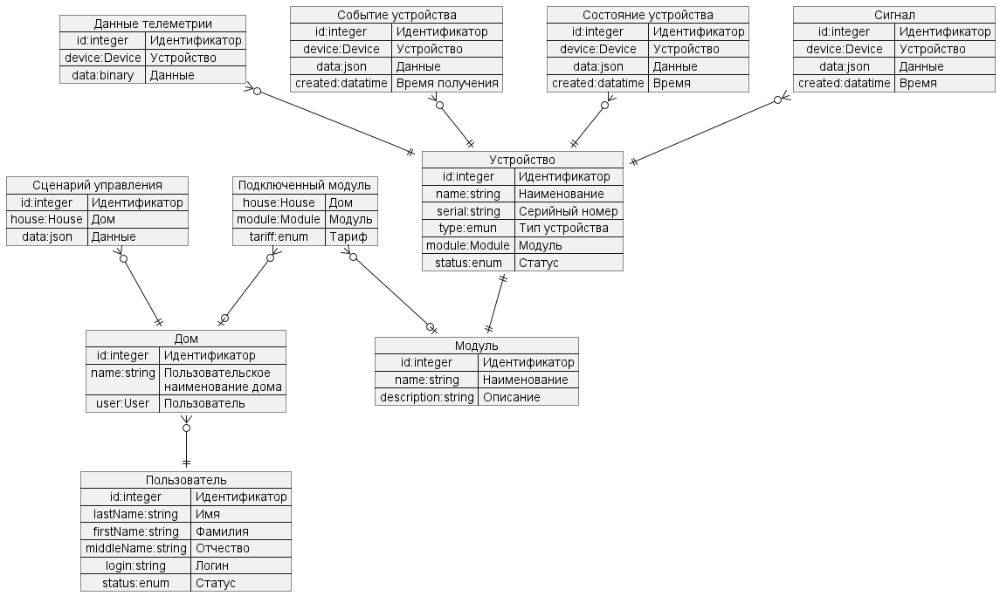

---

_Подзадание 1.1_

---

# As Is

## Параметры приложения

Архитектура: Все компоненты системынаходятся в рамках одного приложения.

Язык программирования: Java

База данных: PostgreSQL

Взаимодействие: Синхронное, запросы обрабатываются последовательно.

Развертывание: не автоматизировано

## Функциональность приложения

В текущем состоянии положение позволяет только управлять отоплением в доме и проверять температуру.

## Деятельность компании

Области деятельности компании в текущий момент ограничены следующими доменами:

1. Домен: Управление пользователями
2. Домен: Управление отоплением
    1. Субдомен: Регистрация реле
    2. Субдомен: Управление реле
3. Домен: Мониторинг температуры
    1. Субдомен: Регистрация датчиков
    2. Субдомен: Управление данными от датчиков

# To Be

В целевом состоянии экосистема должна быть доступна пользователю в режиме самообслуживания по модели SaaS.
Система позволяет управлять отоплением, включать и выключать свет, запирать и отпирать автоматические ворота, удаленно
наблюдать за домом и т.п.
Пользователь самостоятельно выбирает необходимые ему модули умного дома (устройства), сам их подключает, настраивает
сценарии работы и просматривает телеметрию.
Работы по веб-разработке выполняет сторонняя команда.

## Стратегическое планирование деятельности компании

Для достижения целевого состояния предлагается расширить деятельность компании до следующего состояния:

1. Домен: Взаимодействие с пользователем
    1. Субдомен: Управление устройствами
    2. Субдомен: Мониторинг и телеметрия
2. Домен: Контроль устройств
    1. Субдомен: Исполнение сценария
3. Домен: Управление данными
    1. Субдомен: Сбор данных
    2. Субдомен: Анализ данных

---

_Подзадание 1.2_

---

### Архитектура

На основе структуры деятальности компании спроектирована (принимая во внимание закон Конвея) высокоуровневая 
архитектура новой экосистемы, основанная на микросервисах.

1. Взаимодействие с пользователем
   1. Микросервис управления устройствами: 
      1. подключение дома пользователя к системе;
      2. подключение устройств с привязкой к дому;
      3. настройка сценария работы устройств в рамках дома;
   2. Микросервис мониторинга и телеметрии
      1. Просмотр телеметрии
2. Контроль устройств
   1. Микросервис контроля устройств
      1. Исполнение сценария поведения устройств
3. Управление данными
    1. Микросервис сбора данных
        1. получение сигналов с устройств
        2. сохранение состояния устройства
        3. формирование состояния устройств в рамках дома
    2. Микросервис анализа данных
        1. обработка данных телеметрии для мониторинга
        2. формирование отчетов

Также в системе предполагаются служебные сервисы:
1. Шлюз (API Gateway) для клиентских приложений (веб-сайт)
2. Обратный прокси сервер для аутентификации устройств и проксирования запрос-сигналов к устройствам
3. Брокер очередей Kafka для ассинхронной коммуникации микросервисов

Детальный просмотр - в [формате drawio](./arch/context_to_be.drawio)

Далее рассмотрим структуру контейнеров (на примере одного)

#### Управление устройствами (DeviceControl)

Подключение новых устройств, создание сценария поведения, оплата услуг.

### Базовый процесс взаимодействия системы и устройств

---

_Подзадание 1.3_

---

### Предметная область

Проанализирована предметная область. Определены ключевые сущности.
Спроектирована логическая модель данных на базе ключевых сущности и их взаимосвязи.

---

_Подзадание 1.4_

---

### API ассинхронного взаимодействия

Подготовлена спецификация ассинхронного взаимодействия микросервисов через брокер сообщений Kafka

[asyncapi](./arch/asyncapi.yml)

### REST API для интеграции

Подготовлена спецификация REST API для интеграции внешних систем

[restapi](./arch/restapi.yml)